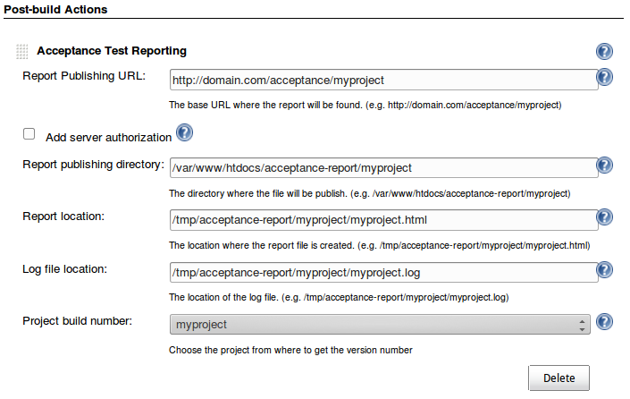

# exactor-jenkins
Jenkins plugin to expose html reports generated with [Exactor](https://github.com/mlieshoff/exactor)

## How does it work

The Exactor Frameword generates an exit html report and probably also an exit log. Exactor-Jenkins will then get those files and copy them to a designated directory exposed by a web server. The copied files will have the build version number attached in the filename, allowing you to archive the reports and pointing to the build number that generated them.

| What my project with Exactor generates | What Exactor-Jenkins does | Waht the Web Server gets |
|:------------------------|-----------------|------------|
|/some_path/exit_report.html|exit_report-23.html|/var/www/myproject/exit_report-23.html|
|/some_path/exit.log|exit-23.log|/var/www/myproject/exit-23.log|

The above example assumes the build version to be 23.

## How to configure it

